# 基于SpringBoot的养老院管理系统 

（源代码+12000字文档+ppt）

## 项目简介

基于SpringBoot的养老院管理系统，分为超级管理员、普通管理员、用户三个角色。 
普通管理员可以在系统中对老人进行宿舍分配以及入住登记，对老人的病例和健康档案进行管理，对伙食、药品进行管理，对老人的外出和来访人员进行报备等操作。 
超级管理员在普通管理员的基础上可以对普通管理员进行管理。 
用户可以在系统中对养老院的收费情况进行查询，并且对老人的身体状况以及饮食进行查看，同时可以查看老人的外出和来访人员记录。 
本系统后端使用spring+mybatis框架。数据库使用的是mysql数据库。 
该系统功能完善，题目较为独特，非常适合作为毕设或者课程作业以及新手开发学习。 

## 功能介绍
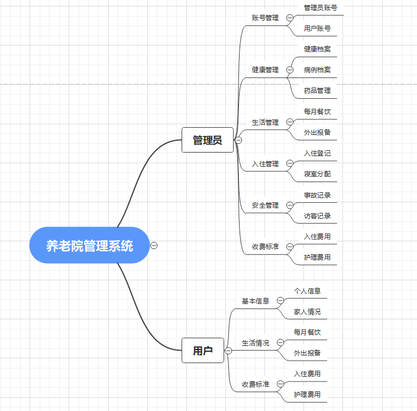 

## 技术服务

## 系统图片
#### 1.登录页面
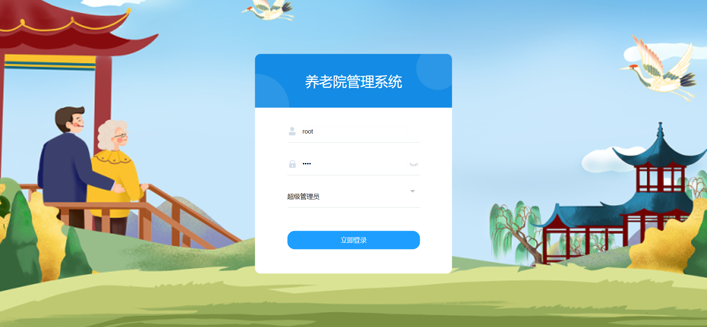 
#### 2.系统首页
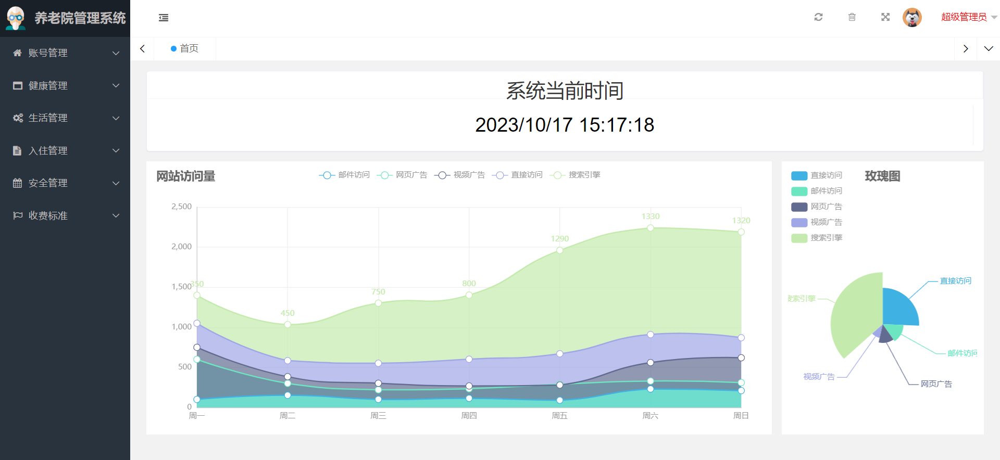 
#### 3.健康档案
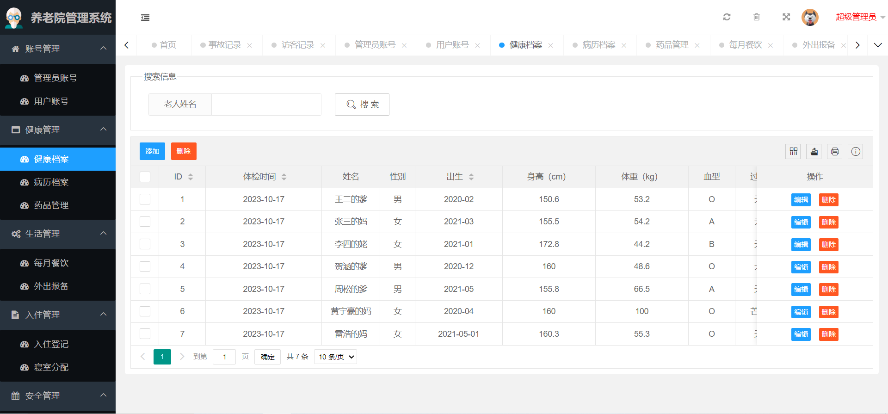 
#### 4.病例档案
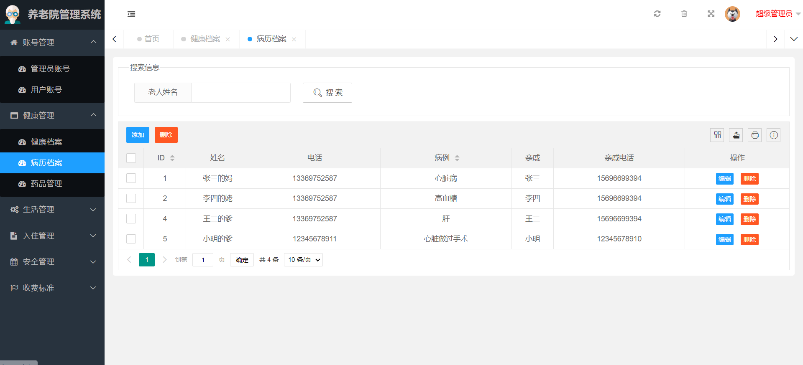 
#### 5.每月餐饮
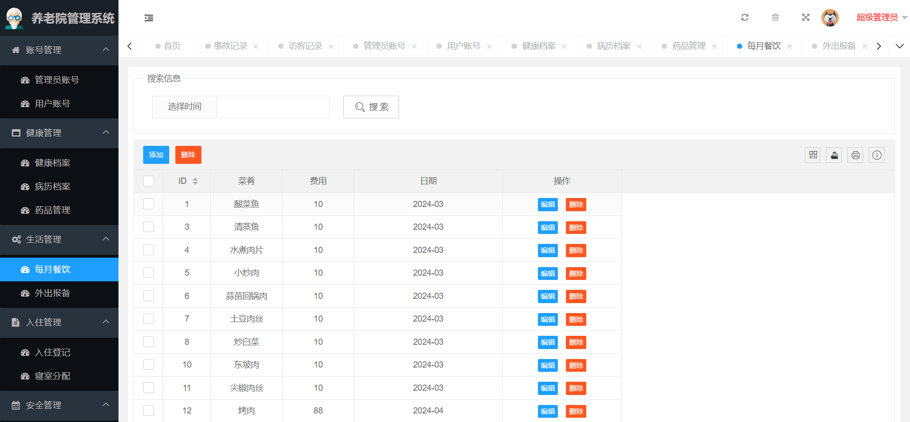 
#### 6.外出报备
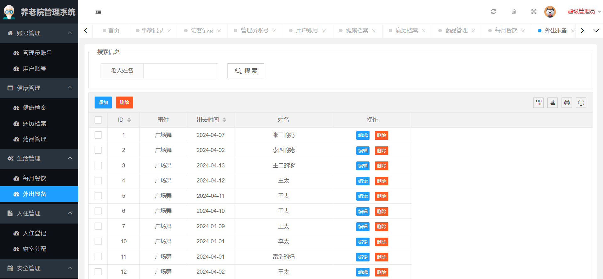 
#### 7.入住登记
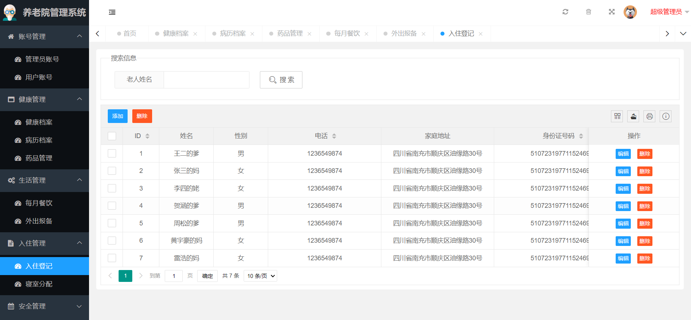 
#### 8.寝室分配
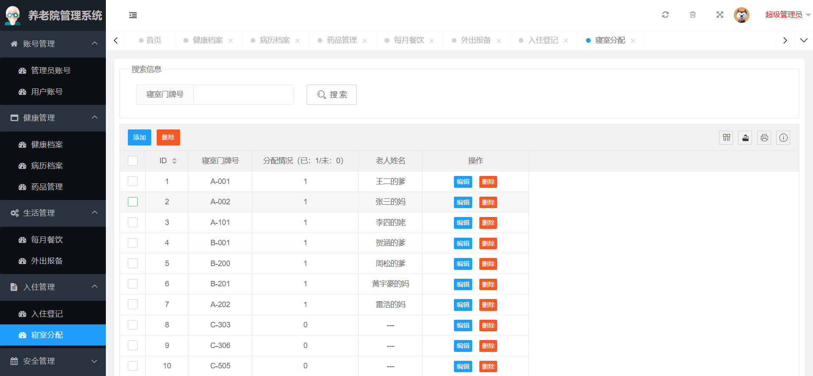 
#### 9.事故记录
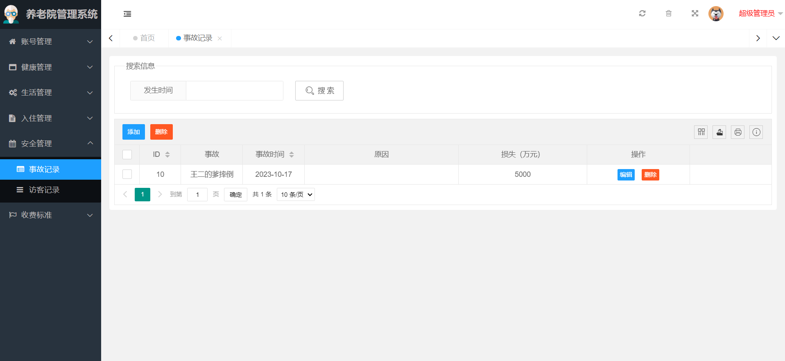 
#### 10.访客记录
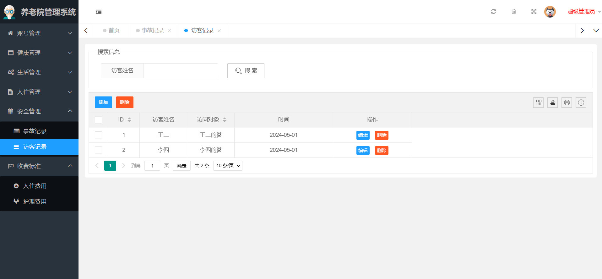 
#### 11.护理费用
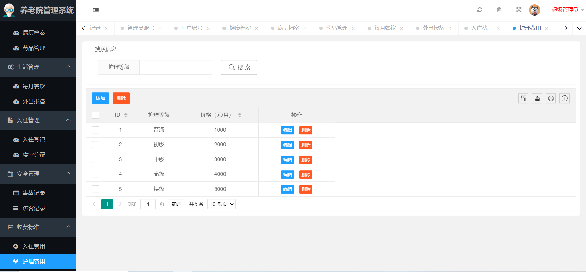 
